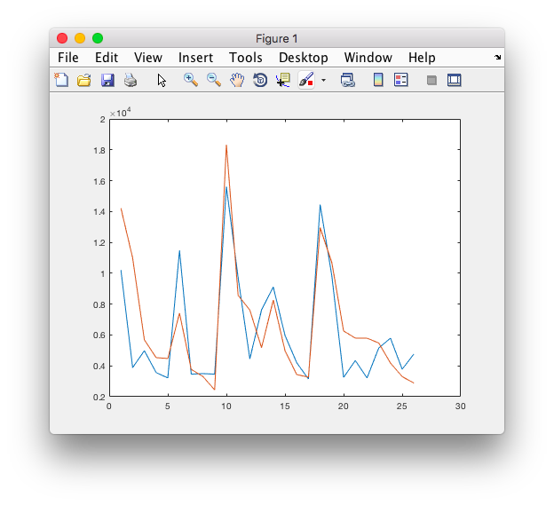
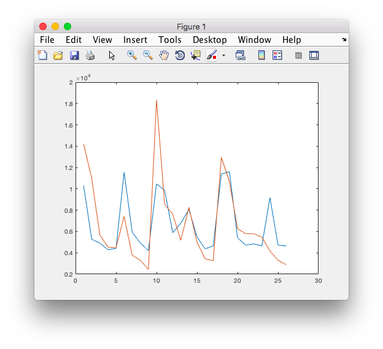
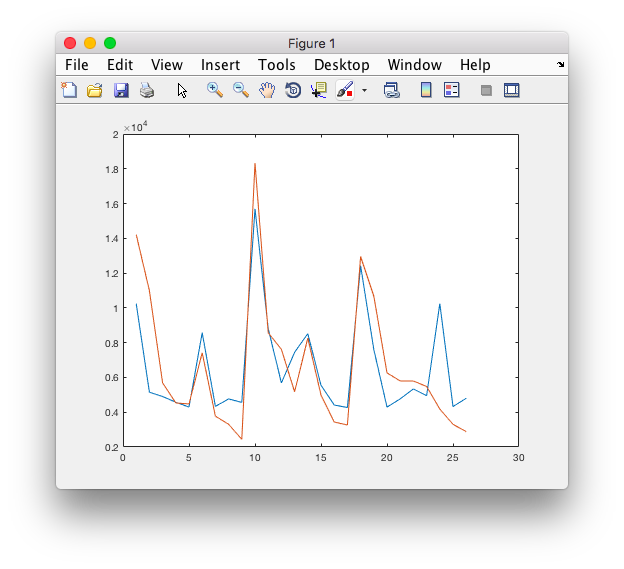
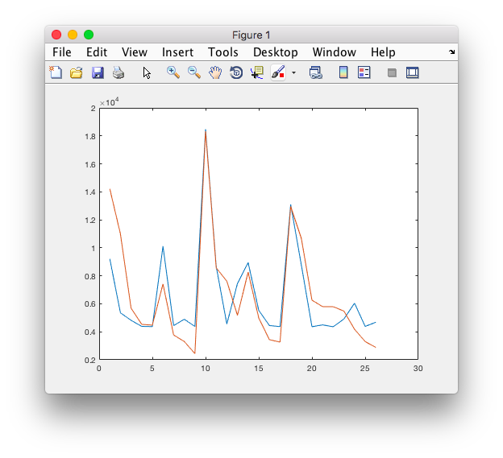
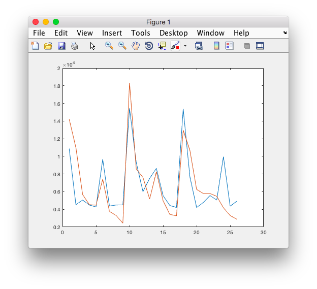

###一、研究主題
探討台灣電影市場討論、評價、熱度、票房等之間的關係，進一步預測電影的票房。

###二、研究動機
電影在我們日常生活中可以說是無所不在，在大台北地區走幾步
就可以看見一家電影院，而每當有新片即將上映，不管在電視廣 告、網路上、路上海報、甚至在公車的廣告上幾乎都可以看到強 打電影的預告片，在網路論壇上、PTT 也都會針對這些電影進行 討論、評價。因此，我們想要探討各電影的討論熱度、評價、票
房等指標之間的關連性，看其是否與我們的生或經驗相符，並進
一部建立模型，試圖透過各種其他參數來預測電影的票房。

###三、研究方法
####1. 資料蒐集
- 以R語言爬取ptt movie版網頁版中2015/01/01~2016/01/31的資料作為分析對象
- 從ptt boxoffice取得2015年台北票房資料
- 爬取2016年的電影資料及前三季的票房作為模型的驗證

####2. 資料整理(preprocessing)
將爬取的raw data轉換為如下的形式：  
```{}
 movie1
  tag replies day
  tag replies day
  ...
 movie2
  tag replies day
  tag replies day
  ...
 movie3
 ...
```
其中：

- tag為將原標題的標籤分類所得，分為pos(好評)、neg(負評)、poor(普評)、other(其他，非評價文或無法判斷評價)
- replies為將原本網頁上顯示的推噓文數轉換為整數，例如爆->100、X2->-20等
- day為該篇文章日期與上映日期之差，若一部電影上映日期為12/31，則12/30為-1、12/31為0、01/01為1，以此類推

####3. 資料分析(EDA)
從上述處理過的資料統計每部電影的好評率，並且考量到平日及週末的差異，故以週為單位，統計總發文數、總推文量並與票房等資訊製作成表格進行分析，如下
```{r}
movies <- read.csv("movie data/2015/processed movie data.csv")
movies
```
其中：

- domestic表示為國片或進口片
- ntitle為該時間區間內的總文章數，後標的0、1、2分別代表上映前一週、首週、次週的數據
- popularity為該時間區間內總推噓文數，後標意義與上同
- rating為好評佔總評論文章的比例
- weightedrating為以推噓文數量加權後的評價，值落在[-1,1]區間

製作上述參數的correlation matrix觀察各參數間的相關性
```{r}
cor(movies[,c(2,5,6,7,8,9,10,11,12)])
```
從上表格大致可看出

- 票房與文章數、總推噓文數等與討論熱度相關的指標都有著中度以上的正相關
- 票房與首週討論熱度的相關性大於上映前一週與次週人氣
- 票房與評價呈現幾乎無相關的狀態
- 探討該週討論熱度、與先前討論熱度的相關性，可發現不論是總文章數或總推噓文數皆是與先前的總推噓文數有較大的相關性
- 評價雖與票房幾乎無相關，但與討論熱度有著低度的相關性
- 評價與上映前一週討論熱度有最高的相關性

做票房與首週文章數的散佈圖
```{r}
library(ggplot2)
qplot(ntitle1, boxoffice, data = movies)
```
由於票房數字呈指數遞增故取log後再次繪圖
```{r}
qplot(ntitle1, log(boxoffice), data = movies)
```


另外觀察電影的人氣衰減速度及其他參數間的關係
取次週與首週的人氣比及其他幾項參數計算correlation
```{r}
cor(movies[,c(2, 5, 8, 11, 12)], movies$ntitle2/movies$ntitle1) 
cor(movies[,c(2, 5, 8, 11, 12)], movies$popularity2/movies$popularity1)
```
大致可看出

- 上映前人氣高的電影上映後人氣衰減較慢
- 人氣衰減速率與票房、評價等有著低度的正相關

####4. 建立模型(ML)
由於我們的資料量並不多，因此優先考慮較不複雜的model
，以避免造成overfitting的現象。

我們選擇使用support vector regression(SVR)的機器學習來建立模型，並選出約30部2016年的電影，以此模型預測票房作為驗證。在接下來的實驗中，我們使用不同的features組合來觀察這些features與票房的相關性。

為了使model有一致性，我們統一使用參數C=1.1, epsilon=0.5。

####5. 實驗數據
首先以之前分所分析擁有最高correlation的ntitle1的線性回歸模型作為後續的比較基準
下方各圖中橫軸代表第x部電影，縱軸為票房(萬)，紅線為實際票房，藍線為預測票房

- baseline (kernel='linear', features=ntitle1)


- RMSE: 2334
- average error: 1752
- standard deviation of error: 1573

#####實驗一：將之前分析過程中所有參數都設為feature，並使用rbf kernel

- experiment 1 (kernel='rbf', features=all)


- RMSE: 2669
- average error: 1934
- standard deviation of error: 1876

#####實驗二：使用ntitle0、ntitle1、ntitle2作為feature

- experiment 2 (kernel='rbf', features=ntitle0, ntitle1, ntitle2)


- RMSE: 2267
- average error: 1639
- standard deviation of error: 1599

#####實驗三：使用ntitle1、ntitle2作為feature

- experiment 3 (kernel='rbf', features=ntitle1, ntitle2)


- RMSE: 2042
- average error: 1523
- standard deviation of error: 1388

#####實驗四：使用ntitle0、ntitle1作為feature

- experiment 4 (kernel='rbf', features=ntitle0, ntitle1)


- RMSE: 2344
- average error: 1743
- standard deviation of error: 1599

####6. 實驗結果分析
由上述實驗的結果可得到以下推論：

- 單純以上映首週文章總數(ntitle1)進行線性回歸即可得到不錯的結果
- 使用上映首週及次週文章總數(ntitle1, ntitle2)作為feature，並使用non-linear的kernal所得到的結果最佳，顯示票房可能與首兩週的熱度以及兩週間的變化有著較大的關連
- 上映前關於電影的討論(ntilte0)與票房的關連性相對較低
- 評價與票房間並無太大的相關性，將其作為feature會使得降低model的品質，有可能是在資料量不足的情況下使用過多feature導致overfitting，也可能是因為大眾喜歡看的爽片常常造成討論風潮，也會讓人放大檢視這部影片，導致類似樹大招風的效應。

###四、研究結果
- 從分析中可以看出票房與討論熱度的正相關，符合一般的常理思考，且若將討論熱度按時間切割，可發現票房與電影上映首週的討論熱度相關性最高。
- 評價與票房的相關性極低或幾乎無相關，顯示約有半數的電影為叫好不叫座及叫座不叫好的情況，現實情況中，大眾喜愛好萊塢特效大片，著重在觀影的感官體驗，而較不重視其劇情，使得此類電影即便因劇情得到不佳的評價仍然能有很好的票房，另一方面，有些電影可能因題材問題較小眾而票房不佳，但對於對其口味的觀眾而言能得到很高的評價。
- 評價與討論熱度有著低度的正相關，顯示好的評價或許能促進網路上的討論，但此部分的討論卻難以反映至票房上
- 評價與上映前的討論熱度有著一定程度的相關性，有可能為在國外有較佳口碑的電影在台上映前就促進網路上對此電影的討論
- 熱度高、評價佳的電影在熱度的衰減上也較慢，較無高流行度快速過氣的現象
- 利用首兩週的討論熱度進行機器學習建立模型，對於預測電影票房有著不錯的表現

###五、未來展望
在這次的實驗以及建模中，我們可以用已知的資訊很好的預測總票房，惟資料量較為不足，未來也許可以使用更多的資料，如嘗試從ptt以外的網站尋找更多年份討論資料，或尋找其他的feature，如電影的製作公司或國家等，嘗試使得模型能夠變的更精準。此外，如果可以使用更少的資訊，如僅前三天的討論度就可以預測到很好的結果，也會增加這個model的實用性。

###六、資料來源
- ptt movie版
- ptt boxoffice版

###附錄一：工作分配
- 王傑生：EDA、數據呈現、書面報告
- 吳岳樺：Machine Learning、數據呈現
- 陳苗霈：爬蟲PTT電影版資料、電影資料整理、投影片報告、書面報告
- 陳彥臻：爬蟲PTT電影版資料、電影資料整理、投影片報告、書面報告
- 徐慶凱：爬蟲PTT電影版資料、電影資料整理、投影片報告、書面報告

###附錄二：Raw Data & Source Code
https://github.com/jason0342/DsR_final_project

See README for more details